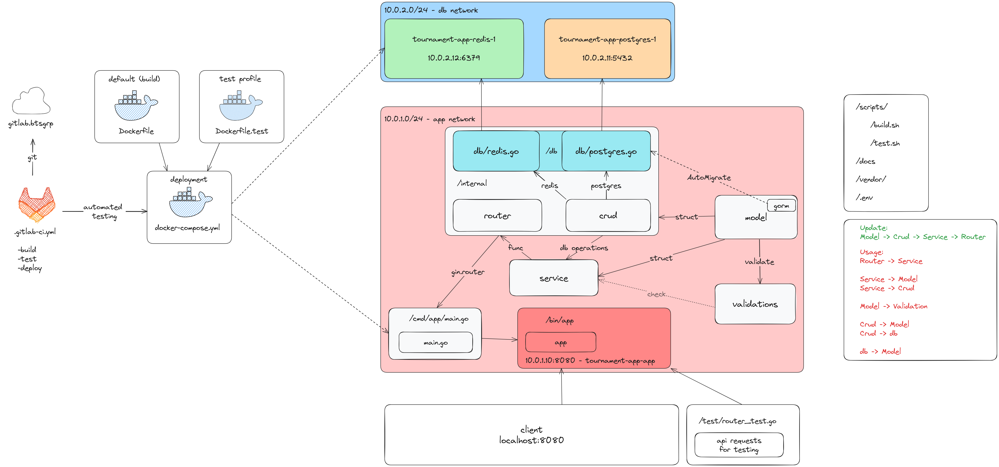

# Tournament API

A Go service for running player tournaments with a live leaderboard. Players are
stored in PostgreSQL through GORM, ranked in a Redis sorted set, and the whole
thing runs as three containers across two isolated Docker networks.

**Project site:** <https://yasinnerten.github.io/tournament/>
It includes a browser simulation of the scoring and prize rules, diagrams of the
request flow, and the full API reference.

## What it does

A tournament is a pot of prize money that players buy into. Joining costs 50
coins. Every player carries a level and a balance, and those two numbers decide
their rank while the tournament runs. When the tenth player joins, the tournament
closes and the pot is paid out down the standings.

Postgres holds the durable records, players, tournaments and archived results.
Redis holds the live ranking as a sorted set, so reading the current standings
never touches Postgres. A finished tournament is written back to Postgres and
dropped from Redis.

## Rules

| Rule | Value | Defined in |
|---|---|---|
| Player score | `level * 100 + money` | `calculateScore` |
| Cost to join a tournament | 50 coins, refused below that | `JoinTournament` |
| Players before a tournament closes | 10 | `JoinTournament` |
| Cost to level up | `100 + level * 50` | `LevelUpUser` |
| First place | half the pot | `calculatePrize` |
| Second place | a quarter of the pot | `calculatePrize` |
| Third place | an eighth of the pot | `calculatePrize` |
| Fourth and below | a sixteenth of the pot each | `calculatePrize` |

## Architecture



Every endpoint follows the same path down the layers:

```
router  ->  service  ->  crud  ->  internal/db  ->  Postgres / Redis
              |
              +-> validation   (checked before any write)
```

The router only parses and responds, the service holds the rules, validation
guards anything heading for a write, and CRUD is the only layer that talks to a
database.

## Project structure

```
cmd/app/main.go          entry point, Gin setup, Swagger route
internal/
  db/postgres.go         connection and AutoMigrate
  db/redis.go            connection and sorted set operations
  crud/users.go          user queries, health pings, ClearDatabase
  crud/tournament.go     tournament and leaderboard queries
  router/users.go        user and operations endpoints
  router/tournament.go   tournament and leaderboard endpoints
model/                   structs, GORM tags, BeforeCreate hooks
service/                 the rules: scoring, joining, prizes, level up
validation/              field checks called before writes
test/router_test.go      endpoint tests
docs/                    generated Swagger package, imported by main.go
site/                    source of the GitHub Pages site
scripts/                 build.sh and test.sh
```

`docs/` is generated by swaggo and committed, and `main.go` imports it for its
side effects. After changing any annotation, regenerate it or the build uses a
stale spec:

```bash
swag init -g cmd/app/main.go -o docs
```

## Running it

`.env` is not committed. Create it first:

```bash
cat > .env <<'EOF'
POSTGRES_DSN=host=postgres user=postgres password=postgres dbname=tournament port=5432 sslmode=disable
DB_USER=postgres
DB_PASSWORD=postgres
DB_NAME=tournament
REDIS_HOST=redis
REDIS_PORT=6379
EOF

docker compose --profile default up --build
```

The API listens on port 8080. Swagger UI is at
<http://localhost:8080/swagger/index.html>.

```bash
curl -s localhost:8080/health

curl -X POST localhost:8080/users -H 'Content-Type: application/json' \
  -d '{"name":"Alice","money":100,"level":1}'
curl -X POST localhost:8080/users -H 'Content-Type: application/json' \
  -d '{"name":"Kassandra","money":500,"level":4}'

curl -X POST localhost:8080/tournaments -H 'Content-Type: application/json' \
  -d '{"name":"Summer Cup","prize":1000}'

curl -X POST localhost:8080/tournaments/join -H 'Content-Type: application/json' \
  -d '{"tournament_id":1,"user_id":1}'

curl -s localhost:8080/leaderboard
```

### Tests

```bash
go test ./...                              # locally
docker compose --profile test up --build   # against containers
```

### Cleaning up

```bash
docker compose --profile default down --remove-orphans
docker rm -f $(docker ps -a -q --filter "status=exited")
```

## API

### Players

| Method | Path | Description |
|---|---|---|
| POST | `/users` | Create a player from a name, balance and level |
| GET | `/users` | List every player |
| GET | `/users/{id}` | Fetch one player |
| PUT | `/users/{id}` | Update a player |
| DELETE | `/users/{id}` | Remove a player |
| POST | `/users/{id}/levelup` | Spend coins to gain a level and rescore |

### Tournaments

| Method | Path | Description |
|---|---|---|
| POST | `/tournaments` | Create a tournament and its empty leaderboard |
| GET | `/tournaments` | List all tournaments with their players |
| GET | `/tournaments/ongoing` | List tournaments in the ongoing state |
| GET | `/tournaments/{id}` | Fetch one tournament |
| PUT | `/tournaments/{id}` | Update a tournament |
| DELETE | `/tournaments/{id}` | Remove a tournament |
| POST | `/tournaments/join` | Buy a player into a tournament |
| POST | `/tournaments/{id}/end` | Close a tournament |

### Leaderboards

| Method | Path | Description |
|---|---|---|
| GET | `/leaderboard` | Current standings, paged with `start` and `stop` |
| GET | `/leaderboard/active` | Same, filtered to active entries |
| GET | `/leaderboard/tournament/{id}` | Standings for one tournament |
| GET | `/leaderboard/tournament/{id}/active` | Active entries for one tournament |
| GET | `/leaderboard/tournament/{id}/finished` | Archived result for a closed tournament |
| GET | `/leaderboard/user/{id}` | Every board a player appears on |
| GET | `/leaderboard/user/{id}/active` | Only the boards still running |

### Operations

| Method | Path | Description |
|---|---|---|
| GET | `/health` | Pings both databases and reports which one is down |
| POST | `/clear-database` | Truncates all three tables, local use only |

## Known gaps

These are real and currently unfixed.

- **Nothing assigns `model.Ongoing`.** Tournaments go straight from planned to
  finished, so `GET /tournaments/ongoing` always returns empty and
  `FinalizeTournament` rejects every tournament it is handed, because it requires
  the ongoing state.
- **`GetTournamentByKey` filters on a `key` column** that the `Tournament` struct
  does not have, so GORM never creates it and the query errors. It is the first
  call inside `FinalizeTournament`, so prize payout cannot run at all.
- **Redis writes to one global `leaderboard` key.** All tournaments share a
  single sorted set, so their standings mix together.
  `RemoveLeaderboardFromRedis` deletes `leaderboard:{id}`, a key nothing writes,
  so the real set is never cleared.
- **`SetLeaderboard` ignores its `key` argument** and creates entries without a
  `TournamentID`, so they cannot be filtered back to their tournament.
- **`Money` and `Level` are tagged `validate:"required"`.** The validator treats
  zero as missing, so a player who spends down to nothing can no longer be
  updated. `gte=0` is what was meant.
- **`EndTournament` needs ten players or an already finished tournament**, so a
  tournament cannot be closed early, though the comment above it says manual
  closing is the point.
- **Postgres and Redis are written without a shared transaction.** A join that
  succeeds in Postgres and then fails at Redis leaves the player charged and
  unranked, with no compensating write.
- **The prize split can exceed the pot.** Ten players in a 1,000 coin tournament
  are paid 500, 250, 125, then 62 each for the remaining seven, which comes to
  1,309.

`to-do.txt` also specifies a leaderboard once three players have joined, while
the code closes the tournament at ten.

## Project site

The site under `site/` is published by `.github/workflows/pages.yml`. It cannot
use the usual "deploy from a branch" setting, because that only accepts the
repository root or `docs/`, and `docs/` is the generated Swagger package. Enable
it once under Settings, Pages, Source, GitHub Actions.

## Contact

- GitHub: [@yasinnerten](https://github.com/yasinnerten/)
- LinkedIn: <https://www.linkedin.com/in/yasinnerten/>
- Website: <https://yasinnerten.com>
